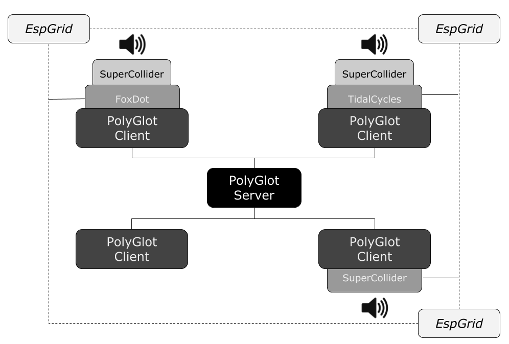

# PolyGlot

## Multi-lingual collaborative live coding

*Polyglot (adjective): knowing or using several languages.*

PolyGlot is a user interface that is designed to allow users to collaborate closely regardless of what languages they know. It also allows users that are skilled across multiple programming languages to utilise their different strengths simultaneously and showcase their multi-lingual virtuosity.

Currently, PolyGlot only allows users to to work with [FoxDot](https://github.com/Qirky/FoxDot), [TidalCycles](https://tidalcycles.org/), and [SuperCollider](http://supercollider.github.io/) but hopefully in the future this number will increase. To synchronise the audio, PolyGlot also requires the [EspGrid](https://github.com/dktr0/EspGrid) tool to be running on your computer. 

## Setting up

### 1. Install the necessary live coding environments

Generating music using multiple live coding languages at once can put quite a strain on your CPU so ideally you should have one member of your ensemble 'hosting' a different language for your jam. So far, PolyGlot can talk to FoxDot, TidalCycles, and SuperCollider (which is required for the first two). Installation instructions can be found via the links below:

- [SuperCollider](http://supercollider.github.io/)
- [FoxDot](https://github.com/Qirky/FoxDot)
- [TidalCycles](https://tidalcycles.org/)

Make sure you've installed your required languages and be sure to test they're working correctly before proceeding.

### 2. Download and run EspGrid

To synchronise the musical events across different live coding environments, PolyGlot relies on the languages being able to interface with the open source synchronisation tool, EspGrid. Installation is usually straightforward but may vary depending on your  operating system so be sure follow instructions carefully. Usually this is just downloading and double-clicking an executable, but instructions for building from source can be found on the page's github. EspGrid will automatically find other instances of EspGrid on your network and co-ordinate tempo and timing, so no further configuration should be required. Only those running a live coding language during a PolyGlot session will require EspGrid to be running on their system.

- [EspGrid GitHub page](https://github.com/dktr0/EspGrid)

### 3. Install necessary SuperCollider Quarks

If you have installed FoxDot and/or TidalCycles you will have encountered "Quarks" for SuperCollider, which are external libraries for the language. Any users who wish  to use SuperCollider as the host language will need to install the "Troop" quark and the "EspGrid" quark using the following code:

    Quarks.install("http://github.com/Qirky/TroopQuark.git")
    Quarks.install("https://github.com/d0kt0r0/Esp.sc.git");

Simply copy and paste it into the SuperCollider window and press `Ctrl+Enter`.

### 4. Setting up for playing

The diagram below outlines how a typical PolyGlot session might look like:

One user (or a separate machine) is running the server application (see "Running the Server" for more information on doing this) and every user is running the client, which is connected to the server. Each user is hosting a different language except one, which is hosting none. All users are co-located and can hear the audio output from any users hosting a language. EspGrid is running on the network, which each language is communicating with to synchronise audio. All users can use the client to execute code on the machine hosting the corresponding language.

**IMPORTANT** - Make sure you run `Troop.start` / `FoxDot.start` in SuperCollider before opening PolyGlot if you are using SuperCollider or FoxDot as the host language.

## Running the Server

## Running the Client
